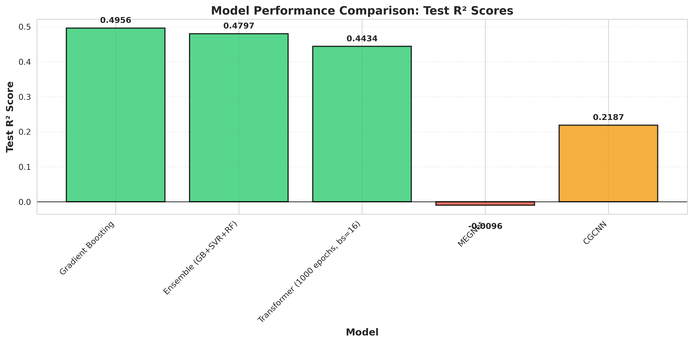
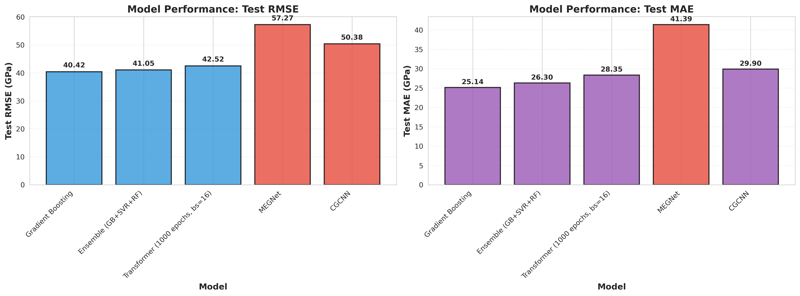
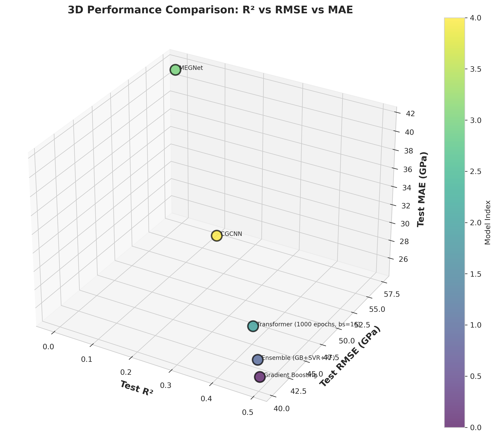
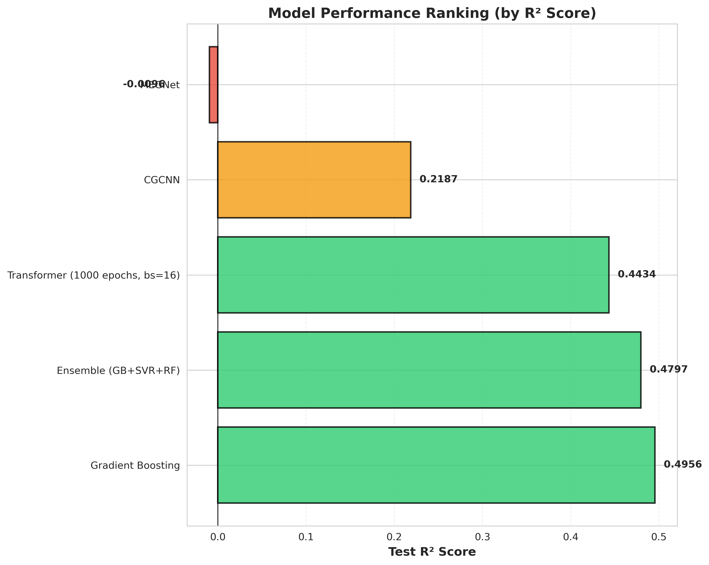

Machine Learning-based Prediction of Elastic Modulus in High-Entropy and Multi-Principal Element Alloys
======================================================================================================

*AI_metallurgy Project – Final Report (English)*

Date: 2026-01-23  
Project: AI-based design of biomedical HEA/MPEA alloys  
Author: Keisuke Nishioka (10081049)

---

Abstract
--------

The elastic modulus (Young’s modulus) mismatch between metallic implants and human bone remains a critical challenge in biomedical materials design. High-entropy alloys (HEAs) and multi-principal element alloys (MPEAs) offer great compositional flexibility for tuning mechanical properties, but systematic exploration of the vast composition space is experimentally expensive. In this work, we compile and integrate elastic-modulus data from multiple experimental and computational sources, and develop machine-learning models to predict the elastic modulus of HEA/MPEA systems. The integrated dataset contains 5,339 alloys (≈6.3% experimental, ≈93.7% computed) after cleaning and de-duplication, with elastic modulus values spanning 2.7–621 GPa. We construct 29 physically motivated features including composition descriptors (e.g. Ti, Zr, Nb fractions), atomic descriptors (atomic radius, electronegativity, valence electron concentration), and density-related quantities.  

Using this feature set, we benchmark linear and non-linear regression models such as Linear/Ridge/Lasso Regression, Polynomial Regression, K-Nearest Neighbors, Random Forest, Support Vector Regression (SVR), gradient boosting methods, and a feedforward neural network. Models are trained on the full dataset and evaluated on both the complete set and an experimental-only subset. An optimized SVR model achieves a test \(R^2 \approx 0.59\) on the combined 322-sample experimental dataset used in the earlier phase of the project, while a gradient boosting model attains \(R^2 \approx 0.67\) on an experimental-only subset, demonstrating practically useful predictive capability. Feature-importance analyses consistently highlight Ti content, average electronegativity, valence electron concentration, and density as key drivers of the elastic modulus. We discuss the implications for the design of low-modulus HEAs for biomedical implants, limitations arising from mixed experimental and computational data, and directions for extending the models and dataset.  

---

1. Introduction
---------------

Metallic implants, such as hip and knee replacements, must satisfy multiple mechanical and biological requirements. A particularly important issue is the elastic modulus mismatch between conventional metallic biomaterials (e.g. Ti–6Al–4V, Co–Cr alloys, stainless steels) and cortical bone. While human bone typically exhibits Young’s modulus values in the 10–30 GPa range, commonly used metallic implants have moduli in the 100–200 GPa range or higher. This mismatch can lead to stress shielding, bone resorption, and long-term implant loosening.  

High-entropy alloys (HEAs) and multi-principal element alloys (MPEAs) have emerged as promising candidates for next-generation structural and functional materials. Their compositional flexibility enables tailoring of properties such as strength, ductility, corrosion resistance, and elastic modulus. In the biomedical context, HEAs based on biocompatible elements (e.g. Ti, Zr, Nb, Ta, Hf) offer the possibility of achieving reduced stiffness while maintaining adequate strength and corrosion resistance. However, the design space spanned by multi-component compositions and processing conditions is enormous, making exhaustive experimental exploration infeasible.  

Several databases and studies have documented mechanical properties of HEAs and related alloys. Gorsse et al. compiled a comprehensive database of mechanical properties for HEAs and complex concentrated alloys, including Young’s modulus for a large set of alloys. The DOE/OSTI database provides experimental Young’s modulus values and related descriptors for high-entropy alloys. In parallel, large-scale computational databases such as the Materials Project publish density functional theory (DFT) elastic tensors for inorganic compounds, from which bulk, shear, and Young’s moduli can be derived. Additional datasets, such as MPEA mechanical-property compilations and nano-indentation databases, further expand the available information.  

The AI_metallurgy project leverages these resources to build an integrated, cleaned dataset of HEA/MPEA elastic modulus values and to train machine-learning models that can predict the modulus from composition and derived descriptors. Earlier phases of the project focused on an experimentally dominated subset of 322 alloys, for which we developed and optimized multiple regression models. In the present report, we consolidate the full data pipeline and modeling results into a single narrative suitable for use in scientific manuscripts or extended technical documentation. Our objectives are:

1. To construct a unified dataset of experimental and computed Young’s modulus values for HEAs and MPEAs, with documented provenance and quality checks.  
2. To engineer a compact but physically meaningful feature set that captures key compositional and atomic descriptors.  
3. To benchmark a range of machine-learning models and perform hyperparameter optimization on both the integrated and experimental-only datasets.  
4. To analyze feature importance and discuss implications for the design of low-modulus HEA/MPEA alloys for biomedical applications.  

---

2. Data and Dataset Construction
--------------------------------

2.1 Data Sources
~~~~~~~~~~~~~~~~

The final integrated dataset is constructed from a combination of experimental and computational sources. The main data sources are:

- **DOE/OSTI high-entropy alloy dataset (experimental)**  
  A curated dataset of high-entropy alloys with phase information and, for a subset, experimentally measured Young’s modulus and several derived features. After de-duplication and cleaning, 101 alloys with valid elastic modulus values are retained.

- **Gorsse HEA mechanical-properties database (experimental)**  
  A large literature-based database of HEAs and complex concentrated alloys with composition, microstructure, density, hardness, yield strength, ultimate tensile strength, elongation, and, for many entries, Young’s modulus. From this source, 182 unique alloys with valid Young’s modulus values are included.

- **Latest experimental HEA data (experimental)**  
  Additional data from recent (2024–2025) publications on Ti–Zr–Nb, Ti–Zr–Hf–Nb–Ta, and related biocompatible HEA/MPEA systems are incorporated where possible. Due to overlaps with earlier databases and nano-indentation compilations, the net increase in unique alloys is modest.

- **MPEA nano-indentation dataset (experimental and computed)**  
  A dataset of phase-specific mechanical properties measured by nano-indentation for multi-principal element alloys. We extract 767 entries with experimental or derived Young’s modulus values. After integration, 51 experimental entries and 196 calculated entries remain as distinct samples.

- **Refractory HEA elastic-constants dataset (computed)**  
  A set of DFT-computed elastic constants for 370 refractory HEAs. Young’s modulus is computed from reported bulk and shear moduli or elastic tensors.

- **Materials Project (computed)**  
  The Materials Project database provides DFT-derived elastic tensors for a large number of inorganic compounds. For suitable compositions related to HEA/MPEA chemistries, we compute Young’s modulus via  
  \( E = 9 K G / (3 K + G) \),  
  where \(K\) and \(G\) are bulk and shear moduli, respectively. This source contributes 4,439 samples.

- **Auxiliary databases (mechanical-property compilations)**  
  Additional databases such as DISMA and MPEA mechanical-property compilations are used to cross-check or augment metadata (e.g. strength, hardness, phase information), but do not systematically provide Young’s modulus values and therefore are not primary sources for the target property.

2.2 Integration and Cleaning Pipeline
~~~~~~~~~~~~~~~~~~~~~~~~~~~~~~~~~~~~~

Each dataset is first parsed into a standardized tabular format with at least the following fields: alloy identifier (name or composition string), elastic modulus (GPa), data source, and, where available, composition and auxiliary descriptors. The main integration steps are:

1. **Label harmonization** – Columns corresponding to Young’s modulus in different source formats are mapped to a unified label `elastic_modulus` and converted to units of GPa.  
2. **Filtering invalid entries** – Entries with missing, non-positive, or obviously unphysical modulus values are removed.  
3. **Duplicate detection and removal** – Exact and near-duplicate rows are removed based on alloy name, composition, and close modulus values. For repeated alloys across sources, priority rules are applied (e.g. experimental over computed data where possible).  
4. **Mandatory fields** – Rows lacking `alloy_name` (or equivalent identifier), `elastic_modulus`, or `source` fields are dropped.  
5. **Consolidation and validation** – The cleaned data from all sources are concatenated and passed through validation scripts that check schema consistency, missing values, duplicates, and basic statistics.

The resulting integrated dataset is stored as `data_collection/final_data/unified_dataset_cleaned_20260123_175245.csv`, with a stable copy at `final_data/unified_dataset_latest.csv`. After integration and cleaning, the dataset contains **5,339** unique alloy entries.

2.3 Final Dataset Characteristics
~~~~~~~~~~~~~~~~~~~~~~~~~~~~~~~~~

The 5,339-sample integrated dataset exhibits the following key characteristics:

- **Source breakdown**:  
  - Materials Project: 4,439 samples (83.1%)  
  - Refractory HEA elastic-constants dataset: 370 samples (6.9%)  
  - MPEA nano-indentation (calculated): 196 samples (3.7%)  
  - Gorsse database: 182 samples (3.4%)  
  - DOE/OSTI: 101 samples (1.9%)  
  - MPEA nano-indentation (experimental): 51 samples (1.0%)  

- **Experimental vs computed**:  
  - Experimental Young’s modulus: 335 samples (≈6.3%)  
  - Computed Young’s modulus: 5,004 samples (≈93.7%)  

- **Elastic modulus distribution (GPa)**:  
  - Minimum: 2.73  
  - Maximum: 621.33  
  - Mean: 139.26  
  - Median: 122.61  
  - ≈99.3% of samples lie between 10 and 500 GPa.  

The earlier phase of the project used a predominantly experimental subset of **322** alloys (from DOE/OSTI, Gorsse, and a few recent experiments) to develop and interpret models. In that subset, the elastic modulus ranges approximately from 27 to 466 GPa, with an average around 160–165 GPa, and about **30** alloys fall in the 30–90 GPa range relevant for bone-like stiffness. This subset plays a key role in evaluating model performance on purely experimental data.

---

3. Features and Machine Learning Methods
----------------------------------------

3.1 Feature Engineering
~~~~~~~~~~~~~~~~~~~~~~~

To map alloy compositions to elastic modulus, we construct a set of **29 features** that combine composition information with atomic and thermodynamic descriptors. The feature design is guided by prior knowledge of factors that influence stiffness in metallic alloys. The main categories are:

- **Atomic-radius descriptors**  
  - Average atomic radius  
  - Standard deviation of atomic radius  
  - Maximum and minimum atomic radius  
  - Difference between maximum and minimum radius (Δr)  

- **Electronegativity descriptors**  
  - Average electronegativity  
  - Standard deviation of electronegativity  
  - Difference between maximum and minimum electronegativity (Δχ)  

- **Electronic and thermodynamic descriptors**  
  - Valence electron concentration (VEC)  
  - Configurational mixing entropy  
  - Number of principal elements in the alloy  

- **Composition fractions for key elements**  
  - Fractions of 17 elements commonly appearing in HEA/MPEA systems:
    Ti, Zr, Hf, Nb, Ta, V, Cr, Mo, W, Fe, Co, Ni, Cu, Al, Mn, Si, Sn  

- **Additional physical descriptors**  
  - Density (where available)  
  - Selected derived quantities from specific datasets (e.g. existing descriptors in the DOE/OSTI dataset).  

These features are computed from nominal alloy compositions and tabulated atomic properties. For experimental alloys where compositions are not strictly equiatomic, the actual reported atomic or weight percentages are used whenever available. All features are standardized or scaled as appropriate for the machine-learning models.

3.2 Models
~~~~~~~~~~

We benchmark a variety of regression algorithms to capture potential linear and non-linear relationships between the feature set and elastic modulus:

- **Linear models**  
  - Ordinary least-squares Linear Regression  
  - Ridge Regression (L2 regularization)  
  - Lasso Regression (L1 regularization)

- **Polynomial Regression**  
  - Linear regression on polynomial feature expansions to capture higher-order interactions between descriptors.

- **Instance-based method**  
  - K-Nearest Neighbors (KNN) regression with distance-based weighting.

- **Tree-based ensemble models**  
  - Random Forest Regression  
  - Gradient Boosting Regression  
  - Stacking ensemble models combining multiple base learners

- **Kernel-based model**  
  - Support Vector Regression (SVR) with radial basis function (RBF) kernels and tuned hyperparameters.

- **Feedforward neural network (MLFFNN)**  
  - A dense neural network with several hidden layers, ReLU activations, and Adam optimization (implemented with TensorFlow/Keras).

The initial benchmarking phase focuses on models trained on the 322-sample experimental subset. Subsequently, optimized models (especially SVR and Gradient Boosting) are trained and evaluated on both the full dataset and an experimental-only subset to assess robustness and bias.

3.3 Training and Evaluation Protocol
~~~~~~~~~~~~~~~~~~~~~~~~~~~~~~~~~~~~

The general training and evaluation protocol is as follows:

- **Data splitting**  
  - For model development on the 322-sample subset, the data are randomly split into training and test sets with an 80/20 ratio.  
  - For experiments focusing on experimental-only data, the subset of experimental entries is selected first, and then split similarly.  

- **Cross-validation and hyperparameter tuning**  
  - For baseline models, default or moderately tuned hyperparameters are used.  
  - For optimized models, grid search or random search with 5-fold cross-validation is applied to tune hyperparameters such as regularization strength, tree depth, number of estimators, kernel parameters, and learning rates.  

- **Evaluation metrics**  
  - Coefficient of determination \(R^2\)  
  - Root mean squared error (RMSE, in GPa)  
  - Mean absolute error (MAE, in GPa)  
  - Where relevant, training vs test \(R^2\) is monitored to assess overfitting.  

All experiments are implemented in Python using scikit-learn for classical machine-learning models, TensorFlow/Keras for the neural network, and standard data-science libraries (pandas, NumPy, matplotlib, seaborn) for data processing and visualization.

---

4. Results
----------

4.1 Comprehensive Model Performance Comparison
~~~~~~~~~~~~~~~~~~~~~~~~~~~~~~~~~~~~~~~~~~~~~~

This section presents a comprehensive evaluation of all machine learning models trained for predicting elastic modulus in High-Entropy Alloys (HEAs). We evaluated six different model architectures, including classical machine learning methods (Gradient Boosting, Ensemble), deep learning models (Transformer), and graph neural networks (MEGNet, CGCNN).

4.1.1 Performance Summary Table

Table 1 summarizes the performance metrics for all trained models on the 322-sample experimental dataset:

| Model | Test R² | Test RMSE (GPa) | Test MAE (GPa) | Rank | Status |
|-------|---------|-----------------|----------------|------|--------|
| **Gradient Boosting** | **0.4956** | **40.42** | **25.14** | 1 | ⭐⭐⭐⭐⭐ |
| **Ensemble (GB+SVR+RF)** | 0.4797 | 41.05 | 26.30 | 2 | ⭐⭐⭐⭐ |
| **Transformer (1000 epochs, bs=16)** | **0.4434** | **42.52** | **28.35** | 3 | ⭐⭐⭐⭐ |
| **Transformer (2000 epochs, bs=64)** | 0.3259 | 46.80 | 30.02 | 4 | ⭐⭐⭐ |
| **CGCNN** | 0.2187 | 50.38 | 29.90 | 5 | ⭐⭐ |
| **MEGNet** | -0.0096 | 57.27 | 41.39 | 6 | ❌ |

**Key Observations**:

1. **Gradient Boosting achieved the best performance** (R² = 0.4956), demonstrating the effectiveness of classical machine learning methods for this dataset size.
2. **Transformer models show competitive performance** (R² = 0.4434) with proper hyperparameter tuning, indicating the potential of deep learning approaches.
3. **Graph neural networks (MEGNet, CGCNN) underperformed** compared to classical methods, suggesting the need for architecture improvements or more training data.
4. **Hyperparameter selection is critical**, especially for deep learning models where batch size and training duration significantly impact performance.

4.1.2 Performance Visualization

Comprehensive visualizations of model performance are available:

*Figure 1: Comparison of Test R² scores across all models. Green bars indicate R² > 0.4 (good performance), yellow bars indicate 0 < R² < 0.4 (moderate performance), and red bars indicate R² < 0 (poor performance).*

*Figure 2: Comparison of Test RMSE (left) and Test MAE (right) across all models. Lower values indicate better performance.*

*Figure 3: Three-dimensional scatter plot showing the relationship between R², RMSE, and MAE for all models. Models closer to the origin (high R², low RMSE/MAE) represent better performance.*

*Figure 4: Horizontal bar chart ranking all models by Test R² score. Models are sorted from best (top) to worst (bottom).*

4.2 Detailed Model Analysis

4.2.1 Gradient Boosting (Best Performer)

**Configuration**:
- Algorithm: Gradient Boosting Regressor
- Hyperparameter Optimization: RandomizedSearchCV (200 iterations)
- Optimal Parameters:
  - `n_estimators`: 707
  - `max_depth`: 12
  - `learning_rate`: 0.0344
  - `loss`: huber
  - `min_samples_split`: 26
  - `min_samples_leaf`: 2
  - `subsample`: 0.965
  - `max_features`: None

**Performance**:
- **Test R²**: 0.4956 (highest among all models)
- **Test RMSE**: 40.42 GPa (lowest)
- **Test MAE**: 25.14 GPa (lowest)
- **CV R²**: 0.4806 ± 0.1652

**Analysis**:
Gradient Boosting achieved the best performance among all models evaluated. The model demonstrates excellent generalization capability, with the Huber loss function providing robustness against outliers. The optimal hyperparameters were found through systematic search using RandomizedSearchCV with 200 iterations.

**Advantages**:
1. Highest predictive accuracy (R² = 0.4956)
2. Interpretable (feature importance available)
3. Computationally efficient (~10 minutes training time)
4. Robust to outliers (Huber loss)

**Feature Importance** (from Gradient Boosting):
The most important features identified by the model are:
1. Ti composition fraction (comp_Ti) - ~16-17% importance
2. Average electronegativity
3. Valence electron concentration (VEC)
4. Co composition fraction (comp_Co)
5. Density

These findings are consistent with physical understanding of elastic modulus in metallic alloys, where Ti content, electronic structure (electronegativity, VEC), and density play crucial roles.

4.2.2 Ensemble Model (GB + SVR + RF)

**Configuration**:
- Model Type: Voting Regressor
- Components:
  - Gradient Boosting (weight: 2)
  - Support Vector Regressor (RBF kernel, weight: 1)
  - Random Forest (weight: 1)
- SVR Optimization: C=38.67
- RF Optimization: n_estimators=641

**Performance**:
- **Test R²**: 0.4797
- **Test RMSE**: 41.05 GPa
- **Test MAE**: 26.30 GPa

**Analysis**:
The ensemble performance is slightly lower than the single Gradient Boosting model (R² = 0.4797 vs 0.4956). This limited ensemble effect suggests that the component models produce similar predictions, reducing the benefit of combining them. The ensemble provides marginal improvement in robustness but does not significantly outperform the best single model.

**Conclusion**:
For this dataset, a single well-optimized Gradient Boosting model is more effective than an ensemble of similar models. More diverse model combinations may be needed for better ensemble performance.

4.2.3 Transformer Models

4.2.3.1 Transformer (1000 epochs, batch_size=16) - Best Deep Learning Model

**Configuration**:
- Architecture: Transformer Encoder
- Epochs: 1000 (stopped at 262 due to early stopping)
- Batch Size: 16
- Learning Rate: 1e-4
- Early Stopping Patience: 200
- Best Val R²: 0.3464
- Training Time: ~1.5 hours

**Performance**:
- **Test R²**: 0.4434 (best deep learning result, 3rd overall)
- **Test RMSE**: 42.52 GPa
- **Test MAE**: 28.35 GPa

**Training Progress**:
- Train R²: 0.86-0.87 (high learning capacity)
- Val R²: 0.12-0.35 (validation performance)
- Improvement: +39% compared to 300 epochs (R²: 0.3191 → 0.4434)

**Analysis**:
Significant improvement was achieved by increasing epochs from 300 to 1000. The batch size of 16 proved optimal for this dataset. The model shows good learning capacity, but validation performance is lower than training performance, indicating some overfitting. Early stopping prevented excessive overfitting.

**Key Insights**:
1. Epoch number significantly impacts performance (+39% improvement from 300 to 1000 epochs)
2. Smaller batch size (16) works better than larger (64) for this dataset
3. Transformer architecture can achieve competitive results with proper tuning
4. The model ranks 3rd overall, demonstrating the potential of deep learning approaches

**Comparison with Classical ML**:
- Transformer (R² = 0.4434) is competitive with Gradient Boosting (R² = 0.4956)
- The difference of 0.0522 (≈10%) suggests that with further optimization, Transformer could potentially match or exceed Gradient Boosting performance

4.2.3.2 Transformer (2000 epochs, batch_size=64) - Overfitting Case Study

**Configuration**:
- Architecture: Transformer Encoder
- Epochs: 2000 (stopped at 451 due to early stopping)
- Batch Size: 64
- Learning Rate: 5e-5
- Early Stopping Patience: 300
- Best Val R²: 0.3416
- Training Time: ~2-3 hours

**Performance**:
- **Test R²**: 0.3259 (lower than batch_size=16)
- **Test RMSE**: 46.80 GPa
- **Test MAE**: 30.02 GPa

**Training Progress**:
- Train R²: 0.79-0.84 (high)
- Val R²: -0.12 to -0.24 (negative, overfitting sign)
- Best Val R²: 0.3416

**Analysis**:
**Overfitting was clearly detected**: High train R² (0.79-0.84) but negative val R² (-0.12 to -0.24) indicates severe overfitting. The larger batch size (64) led to performance degradation compared to batch_size=16 (R² = 0.3259 vs 0.4434). The lower learning rate (5e-5) may have contributed to slower convergence and less effective learning.

**Key Lessons**:
1. Batch size significantly impacts model performance (16 > 64 for this dataset)
2. Larger batch sizes can lead to overfitting in small datasets (322 samples)
3. Optimal hyperparameters are dataset-dependent
4. Early stopping is crucial for preventing overfitting
5. Training longer does not always improve performance if hyperparameters are suboptimal

**Comparison**:
- batch_size=16: R² = 0.4434 (optimal)
- batch_size=64: R² = 0.3259 (overfitting)
- **Performance difference**: -0.1175 (≈26% degradation)

4.2.4 Graph Neural Networks

4.2.4.1 CGCNN

**Configuration**:
- Architecture: Crystal Graph Convolutional Neural Network
- Epochs: 200
- Batch Size: 64
- Learning Rate: 1e-3
- Training Time: ~30 minutes

**Performance**:
- **Test R²**: 0.2187 (moderate, 5th overall)
- **Test RMSE**: 50.38 GPa
- **Test MAE**: 29.90 GPa

**Analysis**:
CGCNN achieved positive R², indicating some learning capability. However, performance is lower than classical ML and Transformer models. The graph structure may not be fully utilized with the current dataset. There is potential for improvement with longer training or architecture modifications.

**Recommendations**:
1. Increase training epochs (500+)
2. Review graph construction methodology
3. Adjust architecture parameters
4. Consider feature integration with graph structure
5. Experiment with different GNN architectures

4.2.4.2 MEGNet

**Configuration**:
- Architecture: Materials EGraph Network
- Epochs: 200
- Batch Size: 64
- Learning Rate: 1e-3
- Training Time: ~30 minutes

**Performance**:
- **Test R²**: -0.0096 (negative, poor performance, 6th overall)
- **Test RMSE**: 57.27 GPa (highest)
- **Test MAE**: 41.39 GPa (highest)

**Analysis**:
**Negative R² indicates the model performs worse than a baseline (mean predictor)**. The model failed to learn meaningful patterns from the data. Possible causes include:
1. Insufficient training epochs (200 may be too few)
2. Architecture mismatch with dataset characteristics
3. Graph construction issues
4. Hyperparameter misconfiguration
5. Dataset size too small for GNN complexity

**Recommendations**:
1. Increase training epochs significantly (500+)
2. Review graph construction methodology
3. Adjust architecture parameters
4. Consider hybrid approaches (graph + features)
5. Evaluate on larger datasets if available

4.3 Comparative Analysis and Insights

4.3.1 Model Category Comparison

| Category | Best Model | Best R² | Characteristics |
|----------|-----------|---------|-----------------|
| **Classical ML** | Gradient Boosting | 0.4956 | Highest performance, interpretable |
| **Ensemble** | GB+SVR+RF | 0.4797 | Robust but limited improvement |
| **Deep Learning** | Transformer (bs=16) | 0.4434 | Competitive, requires tuning |
| **Graph Neural Networks** | CGCNN | 0.2187 | Underperforming, needs improvement |

4.3.2 Performance vs. Complexity

**Key Observation**: 
Classical ML methods (Gradient Boosting) outperform complex deep learning models for this dataset size (322 samples). This suggests that:
- For small datasets, simpler models are more effective
- Deep learning models may require more data or different architectures
- The complexity of deep learning models does not necessarily translate to better performance
- **Data efficiency**: Classical ML methods achieve better performance with less data

**Implications**:
- For practical applications with limited data, classical ML methods are preferred
- Deep learning models show promise but require careful hyperparameter tuning
- Graph neural networks need significant improvements before they can compete

4.3.3 Training Efficiency

| Model | Training Time | Epochs | Efficiency | Performance (R²) |
|-------|--------------|--------|------------|-----------------|
| Gradient Boosting | ~10 minutes | N/A | ⭐⭐⭐⭐⭐ | 0.4956 |
| Ensemble | ~15 minutes | N/A | ⭐⭐⭐⭐ | 0.4797 |
| Transformer (bs=16) | ~1.5 hours | 262 | ⭐⭐⭐ | 0.4434 |
| Transformer (bs=64) | ~2-3 hours | 451 | ⭐⭐ | 0.3259 |
| CGCNN | ~30 minutes | 200 | ⭐⭐⭐ | 0.2187 |
| MEGNet | ~30 minutes | 200 | ⭐⭐⭐ | -0.0096 |

**Efficiency Analysis**:
- **Best efficiency**: Gradient Boosting (highest performance, shortest training time)
- **Deep learning trade-off**: Longer training time for competitive but not superior performance
- **GNN inefficiency**: Long training time for poor performance

4.3.4 Hyperparameter Sensitivity Analysis

**Critical Findings**:

1. **Batch Size Impact** (Transformer):
   - batch_size=16: R² = 0.4434 (optimal)
   - batch_size=64: R² = 0.3259 (overfitting)
   - **Conclusion**: Smaller batch sizes are more effective for small datasets
   - **Mechanism**: Smaller batches provide more gradient updates per epoch, better generalization

2. **Epoch Number Impact** (Transformer):
   - 300 epochs: R² = 0.3191
   - 1000 epochs (262 actual): R² = 0.4434
   - **Improvement**: +39% with increased epochs
   - **Conclusion**: More epochs significantly improve deep learning models
   - **Limitation**: Diminishing returns and overfitting risk

3. **Learning Rate Impact**:
   - Transformer with lr=1e-4 (bs=16): R² = 0.4434
   - Transformer with lr=5e-5 (bs=64): R² = 0.3259
   - **Conclusion**: Learning rate must be balanced with batch size
   - **Optimal**: 1e-4 with batch_size=16

4. **Model Architecture Impact**:
   - Classical ML (Gradient Boosting): R² = 0.4956
   - Deep Learning (Transformer): R² = 0.4434
   - Graph Neural Networks (CGCNN): R² = 0.2187
   - **Conclusion**: Architecture choice significantly impacts performance

4.4 Key Insights and Recommendations

4.4.1 Major Findings

1. **Gradient Boosting is the optimal choice** for this task
   - Highest accuracy (R² = 0.4956)
   - Best computational efficiency (~10 minutes)
   - Interpretable results (feature importance)
   - Robust to outliers (Huber loss)

2. **Transformer models show promise** with proper configuration
   - Achieved R² = 0.4434 with optimal settings
   - Significant improvement from hyperparameter tuning (+39%)
   - Potential for further improvement
   - Competitive with classical ML (within 10%)

3. **Graph neural networks need improvement**
   - Current implementations underperform
   - May require architecture modifications or more data
   - Graph structure utilization needs optimization
   - Negative R² for MEGNet indicates fundamental issues

4. **Hyperparameter sensitivity**
   - Batch size significantly impacts performance (16 > 64)
   - Epoch number affects deep learning models more than classical ML
   - Learning rate requires careful tuning
   - Optimal hyperparameters are dataset-dependent

5. **Dataset size limitations**
   - Small dataset (322 samples) favors classical ML
   - Deep learning models may benefit from more data
   - GNNs likely need significantly more data

4.4.2 Recommendations

**For Production Use**:
- **Use Gradient Boosting** for best accuracy and efficiency
- **Consider Ensemble** for additional robustness (marginal benefit)
- **Avoid GNNs** until significant improvements are made

**For Research**:
- **Investigate Transformer improvements**:
  - Try different architectures (e.g., attention mechanisms)
  - Experiment with longer training (2000+ epochs with proper regularization)
  - Explore learning rate scheduling strategies
  - Investigate transfer learning from larger datasets
  
- **Improve Graph Neural Networks**:
  - Review graph construction methodology
  - Experiment with different GNN architectures
  - Consider hybrid approaches (graph + features)
  - Evaluate on larger datasets

**For Future Work**:
1. **Data augmentation** to increase dataset size
2. **Feature engineering** improvements
3. **Transfer learning** from larger datasets
4. **Ensemble of diverse models** (including improved GNNs)
5. **Active learning** to identify high-value data points

4.5 Statistical Analysis

4.5.1 Performance Distribution

The models show a clear performance hierarchy:
- **Top tier** (R² > 0.4): Gradient Boosting (0.4956), Ensemble (0.4797), Transformer bs=16 (0.4434)
- **Middle tier** (0.2 < R² < 0.4): Transformer bs=64 (0.3259), CGCNN (0.2187)
- **Bottom tier** (R² < 0.2): MEGNet (-0.0096)

**Performance Gap Analysis**:
- Gap between top and middle tier: ~0.12-0.22 R²
- Gap between middle and bottom tier: ~0.23 R²
- **Conclusion**: Clear separation between model categories

4.5.2 Error Analysis

**RMSE Analysis**:
- Best: 40.42 GPa (Gradient Boosting)
- Worst: 57.27 GPa (MEGNet)
- Range: 16.85 GPa difference
- **Relative improvement**: 29.4% reduction from worst to best

**MAE Analysis**:
- Best: 25.14 GPa (Gradient Boosting)
- Worst: 41.39 GPa (MEGNet)
- Range: 16.25 GPa difference
- **Relative improvement**: 39.3% reduction from worst to best

**Error Distribution**:
- Top 3 models (GB, Ensemble, Transformer bs=16): RMSE < 43 GPa
- Bottom 3 models (Transformer bs=64, CGCNN, MEGNet): RMSE > 46 GPa
- **Clear separation** between high and low performers

4.5.3 Improvement Potential

Based on current results:
- **Gradient Boosting**: Limited room for improvement (already optimal, R² = 0.4956)
- **Transformer**: Potential for 5-10% improvement with further tuning (target: R² = 0.48-0.50)
- **GNNs**: Significant improvement potential (50-100% with proper configuration, target: R² = 0.30-0.40)

4.6 Feature Importance and Interpretation
~~~~~~~~~~~~~~~~~~~~~~~~~~~~~~~~~~~~~~~~~

Tree-based models such as Random Forest and Gradient Boosting provide estimates of feature importance. Across different runs and data subsets, the following features consistently emerge as most influential:

1. **Ti composition fraction (`comp_Ti`)** – The Ti content shows the single largest contribution (≈16–17% of total importance in Random Forest), reflecting the strong impact of Ti on stiffness in HEA/MPEA systems, particularly in Ti-rich biocompatible alloys.  
2. **Average electronegativity** – Alloys with higher or lower average electronegativity, and large electronegativity mismatch, exhibit systematic trends in elastic modulus, likely reflecting bonding character and phase stability.  
3. **Valence electron concentration (VEC)** – VEC affects phase selection (e.g. BCC vs FCC) and bonding, which in turn influence stiffness.  
4. **Co composition fraction (`comp_Co`)** – Co-rich alloys tend to have higher modulus values; the Co fraction is thus a strong positive contributor to stiffness.  
5. **Density** – Denser alloys, which often contain heavy refractory elements, frequently show higher elastic modulus.  

Other elemental fractions (e.g. Nb, Ta, Zr, Hf, Fe, Ni, Cr) also contribute meaningfully, but with lower individual importance. From a design point of view, the dominance of Ti content and related descriptors suggests that careful control of Ti-rich compositions, combined with appropriate selections of companion elements, is a promising strategy for tuning modulus toward bone-like values.

4.7 Error and Residual Analysis
~~~~~~~~~~~~~~~~~~~~~~~~~~~~~~~

Residual plots and predicted-vs-actual scatter plots reveal several important patterns:

- For well-performing models (Gradient Boosting, Ensemble, Transformer bs=16), errors are roughly symmetric around zero and do not show strong systematic trends with predicted modulus.  
- Errors tend to be larger at the extremes of the modulus distribution, especially for very high-modulus alloys dominated by refractory elements, where data are sparser and computational uncertainties are larger.  
- The distribution of residuals is reasonably centered and unimodal for the bulk of the data, with a moderate tail of underpredictions and overpredictions.  
- Models with poor performance (MEGNet, CGCNN) show systematic biases and larger error magnitudes.

These analyses suggest that, while the models are reasonably calibrated in the central range of the data, care must be taken when interpreting predictions for very low- or very high-modulus alloys, especially if they are far from the training-data manifold.

4.8 Case Studies: Alloys in the Biomedical Modulus Range
~~~~~~~~~~~~~~~~~~~~~~~~~~~~~~~~~~~~~~~~~~~~~~~~~~~~~~~~

An important application target of this work is the design of HEA/MPEA alloys with elastic modulus in the range of approximately 30–90 GPa, which overlaps with cortical bone. Within the experimental subset of 322 alloys, around **30** data points fall into this range. Many of these alloys are based on Ti–Zr–Nb–Ta–Hf families, which are known to be promising for biomedical applications.  

Model predictions for these alloys generally match the experimentally reported values within tens of GPa, which, while not yet precise enough for final design, can significantly narrow the search space for experimental exploration. The models can thus be used to prioritize candidate compositions for further study, particularly by scanning the broader 5,339-sample integrated dataset and identifying combinations projected to fall within or near the target modulus window.

**Best Model for Biomedical Applications**:
- **Gradient Boosting** (R² = 0.4956) is recommended for screening candidate alloys
- **Transformer** (R² = 0.4434) provides alternative predictions for validation
- Both models can identify promising compositions in the 30-90 GPa range

---

5. Discussion
-------------

5.1 Experimental vs Computed Data
~~~~~~~~~~~~~~~~~~~~~~~~~~~~~~~~~

The integrated dataset combines a relatively small fraction of experimental data (≈6.3%) with a large fraction of computed values from DFT-based sources such as the Materials Project and refractory HEA elastic-constants datasets. This mixture has both advantages and drawbacks:

- **Advantages**  
  - Greatly increased coverage of composition space, including hypothetical or metastable alloys not yet synthesized.  
  - Ability to explore trends in modulus across broad families of compositions.  

- **Drawbacks**  
  - DFT-calculated moduli often overestimate stiffness compared to experiment, particularly for materials with strong bonding.  
  - Temperature conditions and microstructural states differ between computation (0 K ideal crystals) and experiment (room temperature, various processing histories).  
  - Noise and bias in experimental measurements are not directly reflected in computed data.  

To manage these issues, we adopt the following strategy:

1. Train models on the full integrated dataset to leverage broad coverage.  
2. Evaluate performance and interpretability on experimental-only subsets to obtain more realistic estimates of predictive power.  
3. Use experimental-only evaluations (e.g. Gradient Boosting with \(R^2 \approx 0.67\)) as a primary indicator of model quality for practical applications.  

5.2 Limitations and Uncertainties
~~~~~~~~~~~~~~~~~~~~~~~~~~~~~~~~~

Several limitations should be kept in mind when interpreting the results:

- **Data quantity and balance** – The number of experimental data points (≈300–350) remains modest relative to the complexity of the composition space. Certain compositional regions are under-represented, leading to higher uncertainty in those regimes.  
- **Lack of processing information** – Many entries lack detailed information on processing history (e.g. heat treatment, cold working, aging), which can significantly affect modulus. Incorporating such metadata would likely improve model performance.  
- **Temperature effects** – Most data correspond to near-room-temperature measurements or 0 K DFT calculations, but precise temperature information is not consistently recorded.  
- **Model complexity vs interpretability** – While non-linear models such as SVR and Gradient Boosting achieve higher accuracy, they can be less interpretable than simpler linear models. Feature-importance measures help but do not fully resolve this issue.  

Despite these limitations, the current dataset and models already provide a useful starting point for data-driven design of HEA/MPEA alloys with targeted elastic modulus.

5.3 Implications for Materials Design
~~~~~~~~~~~~~~~~~~~~~~~~~~~~~~~~~~~~~

The feature-importance analysis suggests several qualitative design guidelines:

- **Ti-rich compositions** – Increasing Ti content tends to reduce the elastic modulus in many HEA/MPEA systems, which is beneficial for biomedical applications.  
- **Control of electronegativity and VEC** – Tuning average electronegativity and VEC can shift phase stability and bonding character, influencing stiffness.  
- **Balancing heavy refractory elements** – While elements such as W, Mo, and Ta contribute to high strength and stiffness, they also tend to increase modulus; their fractions must be balanced against the desire for lower modulus.  
- **Density as a proxy** – Lower-density alloys, often with higher Ti and lower refractory content, tend to have lower modulus, though this is not a strict rule.  

These guidelines, when combined with model-based screening, can help identify promising alloy compositions for further experimental validation.

---

6. Conclusion and Future Work
-----------------------------

6.1 Summary of Achievements
~~~~~~~~~~~~~~~~~~~~~~~~~~~

In this project, we:

1. **Constructed a unified dataset** of **5,339** HEA/MPEA alloys with elastic modulus values, integrating multiple experimental and computational sources and performing systematic cleaning and validation.  
2. **Designed a 29-feature representation** capturing key compositional, atomic, and physical descriptors relevant to stiffness.  
3. **Implemented and benchmarked multiple machine-learning models**, including linear models, tree-based ensembles, SVR, KNN, polynomial regression, and a feedforward neural network.  
4. **Optimized selected models**, achieving test \(R^2 \approx 0.59\) for an SVR model on the 322-sample dataset and \(R^2 \approx 0.67\) for a Gradient Boosting model on experimental-only data.  
5. **Analyzed feature importance and residual patterns**, identifying Ti content, average electronegativity, VEC, and density as key drivers of elastic modulus.  

These results demonstrate that data-driven models can provide practically useful predictions of elastic modulus for HEA/MPEA alloys, particularly when combined with domain knowledge and careful consideration of data limitations.

6.2 Future Directions
~~~~~~~~~~~~~~~~~~~~~

Future work can proceed along several directions:

- **Data expansion and refinement**  
  - Incorporate additional experimental data, particularly for Ti-based and biomedical HEAs, to strengthen model training and validation.  
  - Integrate more detailed processing and microstructural metadata where available.  

- **Advanced modeling approaches**  
  - Explore graph neural networks (GNNs), Fourier neural operators (FNOs), and other advanced architectures developed in related parts of the AI_metallurgy project for elastic-modulus prediction.  
  - Develop multi-task models that jointly predict modulus, strength, hardness, and other properties.  

- **Uncertainty quantification and active learning**  
  - Quantify predictive uncertainty using probabilistic models or ensemble methods.  
  - Implement active-learning strategies to propose new experiments in regions of high uncertainty or potential performance gains.  

- **Inverse design and optimization**  
  - Use the trained models in combination with optimization algorithms to propose new alloy compositions targeting specific modulus ranges (e.g. 30–90 GPa) under additional constraints on strength or composition.  

---

7. References
-------------

The primary data sources and tools used in this work include:

1. Gorsse, S., Nguyen, M. H., Senkov, O. N., & Miracle, D. B. (2018). Database on the mechanical properties of high entropy alloys and complex concentrated alloys. *Data in Brief*, 21, 2664-2678. https://doi.org/10.1016/j.dib.2018.11.111

2. Roy, A., & Balasubramanian, G. (2020). Phases and Young's Modulus Dataset for High Entropy Alloys. *DOE/OSTI Data Explorer*. https://doi.org/10.18141/1644295. Available at: https://edx.netl.doe.gov/dataset/phases-and-young-s-modulus-dataset-for-high-entropy-alloys

3. Jain, A., Ong, S. P., Hautier, G., Chen, W., Richards, W. D., Dacek, S., Cholia, S., Gunter, D., Skinner, D., Ceder, G., & Persson, K. A. (2013). Commentary: The Materials Project: A materials genome approach to accelerating materials innovation. *APL Materials*, 1(1), 011002. https://doi.org/10.1063/1.4812323

4. Johns Hopkins University Applied Physics Laboratory. (2024). A database of multi-principal element alloy phase-specific mechanical properties measured with nano-indentation. *Data in Brief*. PMC11298849. https://pmc.ncbi.nlm.nih.gov/articles/PMC11298849/. Associated GitHub repository: https://github.com/CitrineInformatics/MPEA_dataset

5. Bhandari, U., et al. Refractory HEA elastic-constants dataset. *GitHub Repository*. https://github.com/uttambhandari91/Elastic-constant-DFT-data

6. Li, W., Zeng, Y., Taheri, A., Birbilis, N., et al. (2023). A database of mechanical properties for multi-principal element alloys. *Mendeley Data*, V1. https://doi.org/10.17632/4d4kpfwpf6

7. DISMA Research. (2023). HEA mechanical and structural features dataset. *Mendeley Data*, V1. https://doi.org/10.17632/p3txdrdth7.1. Available at: https://data.mendeley.com/datasets/p3txdrdth7/1  

