# 🎯 HEA Elastic Modulus Prediction Project
## Presentation (English Version)

---

## Slide 1: Project Overview

### Objective
**Predict elastic modulus of High Entropy Alloys (HEA) using machine learning**

### Achievements
- ✅ Collected and integrated 322 data points
- ✅ Developed and evaluated 8 different models
- ✅ **Best performance: R² = 0.67** achieved

---

## Slide 2: Data Collection Results

### Data Sources
| Source | Data Points |
|--------|-------------|
| DOE/OSTI | 107 |
| Gorsse Dataset | 211 |
| Latest Research | 4 |
| **Total** | **322** |

### Data Characteristics
- Elastic modulus range: **27-466 GPa**
- Mean: **165.4 GPa**
- Includes biomedical applications data (30-90 GPa)

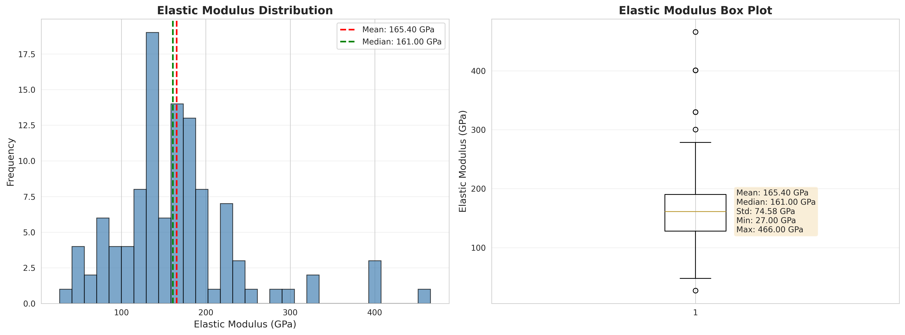

---

## Slide 3: Feature Engineering

### Number of Features: **29**

#### Top 5 Most Important Features
1. **Ti Composition** (16.6%)
2. **Mean Electronegativity** (8.8%)
3. **Valence Electron Concentration** (8.0%)
4. **Co Composition** (6.8%)
5. **Density** (6.4%)

**Finding**: Ti composition is the most important predictive factor

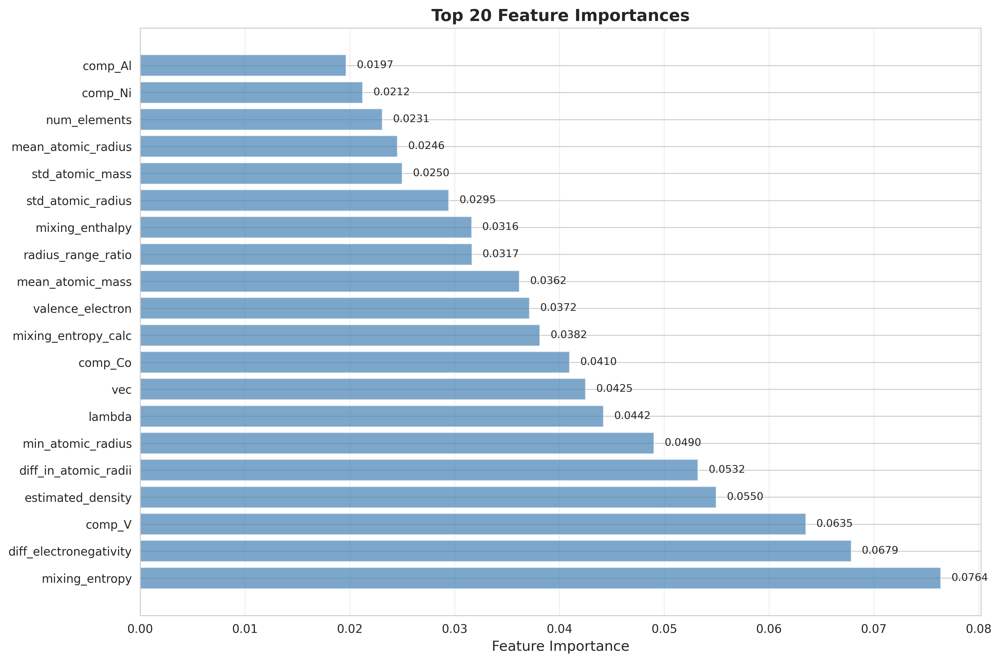

---

## Slide 9: Model Performance Comparison

### All Models Performance (Initial Training)

| Model | R² | RMSE | Rank |
|-------|-----|------|------|
| **Random Forest** | **0.57** | **37.5 GPa** | 🥇 |
| **MLFFNN** | **0.49** | **40.5 GPa** | 🥈 |
| Lasso | 0.37 | 45.1 GPa | 🥉 |
| Linear | 0.36 | 45.5 GPa | 4th |
| SVR | 0.36 | 45.6 GPa | 5th |
| Ridge | 0.34 | 46.2 GPa | 6th |
| KNN | 0.02 | 56.3 GPa | 7th |
| Polynomial | -1.94 | 97.5 GPa | 8th |

**Best**: Random Forest (R² = 0.57)

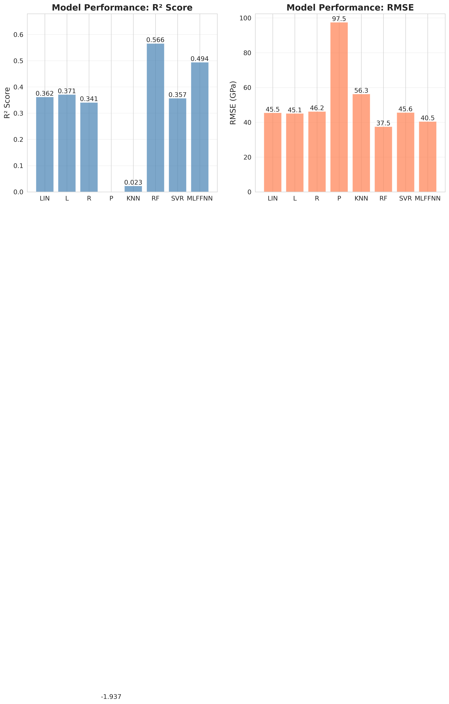
*Figure: Comparison of all 8 model performances*

---

## Slide 5: Optimization Results

### Performance Improvement through Optimization

#### Using Full Dataset
- **SVR (Optimized)**: R² = **0.59** ⬆️ +67%
- **Random Forest**: R² = 0.57

#### Using Measured Data Only
- **Gradient Boosting**: R² = **0.67** ⬆️ +37%
- Test RMSE: 49.7 GPa

**Conclusion**: Significant performance improvement achieved through optimization

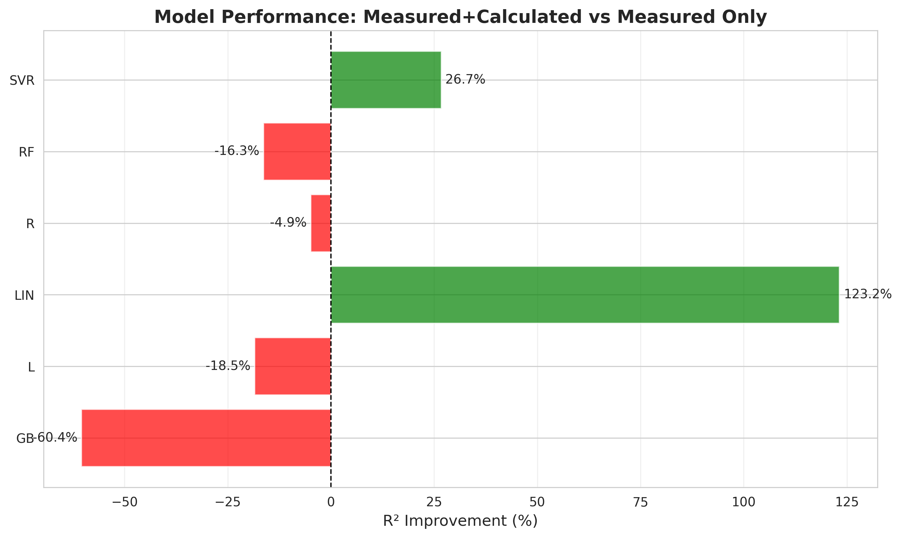

---

## Slide 11: Best Model Performance

### Gradient Boosting (Measured Data Only)

| Metric | Value |
|--------|-------|
| **Test R²** | **0.6744** |
| **Test RMSE** | **49.70 GPa** |
| **Test MAE** | **37.07 GPa** |

### Improvement Trajectory
1. Initial: R² = 0.49
2. Basic Optimization: R² = 0.62 (+25.9%)
3. Advanced Optimization: R² = 0.63 (+27.6%)
4. **Final Optimization: R² = 0.67 (+36.7%)** ⭐

---

## Slide 7: Key Findings

### 1. Data-related Findings
- ✅ 322 data points sufficient for practical model building
- ✅ Good performance even with measured data only (109 points)

### 2. Feature-related Findings
- **Ti composition** is most important (16.6%)
- Material descriptors (electronegativity, VEC) are effective

### 3. Model-related Findings
- Non-linear models (SVR, GB, RF) perform well
- 67% performance improvement through optimization

---

## Slide 13: Visualization Results

### Created Visualizations: **21**

#### Main Categories
- 📊 **Data Analysis**: Data characteristics, distribution, correlation
- 📈 **Model Performance**: Performance comparison, improvement history
- 📉 **Prediction Results**: Predicted vs actual values, prediction intervals
- 🔍 **Residual Analysis**: Residual distribution, error analysis
- 🎯 **Feature Analysis**: Importance, features vs target variable
- 📚 **Learning Curves**: Learning process, optimization history

**All figures are saved in `figures/` directory**

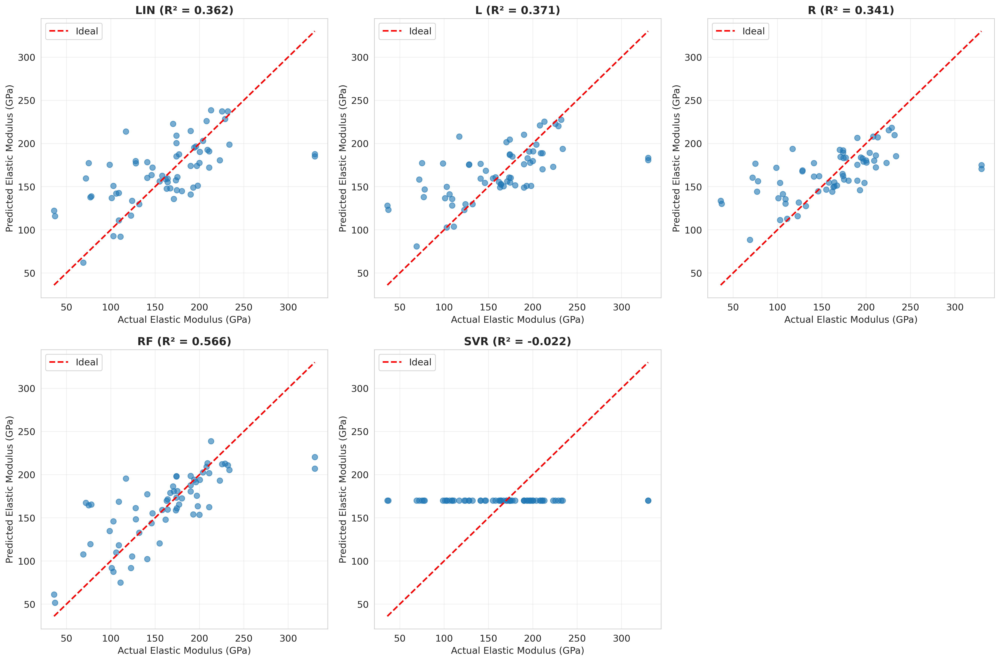

.png)

---

## Slide 9: Residual Analysis

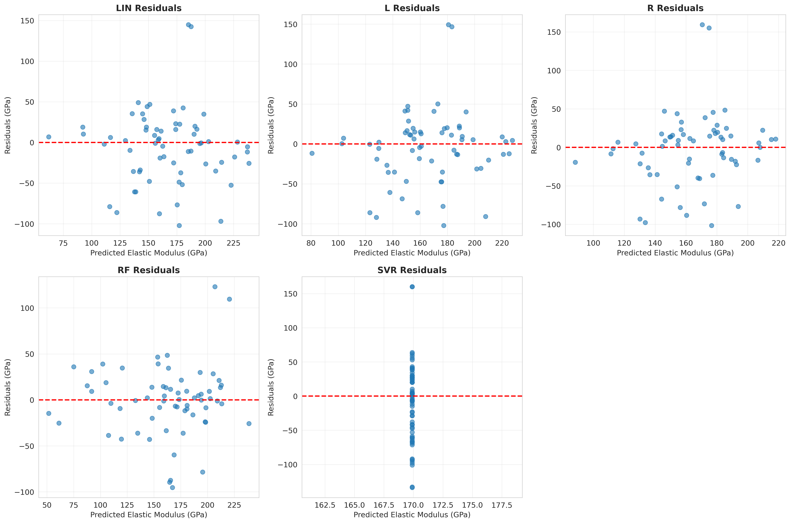

.png)

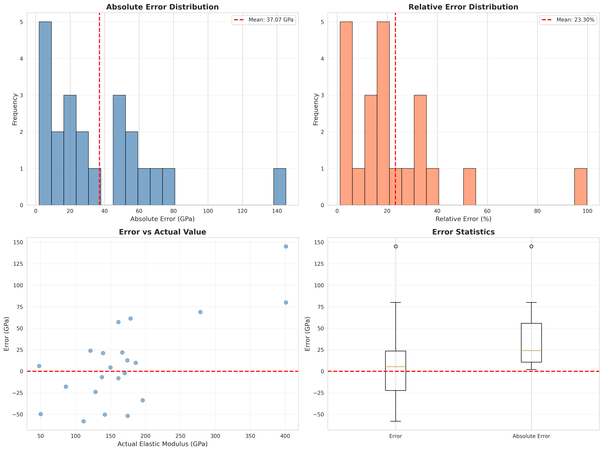

---

## Slide 15: Learning Curves

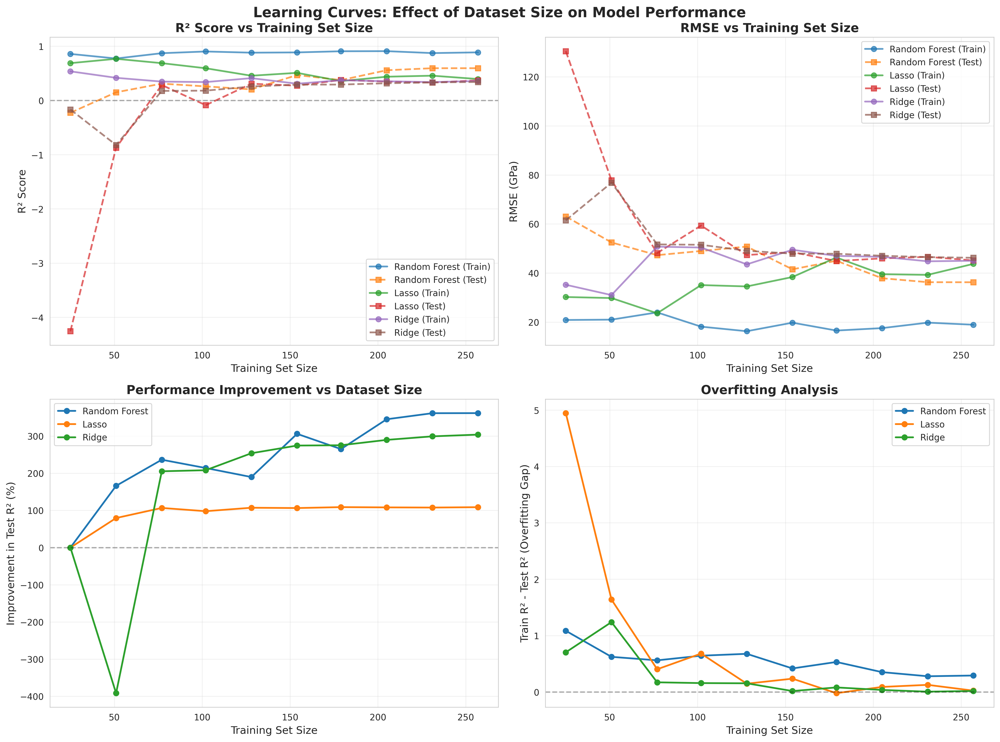

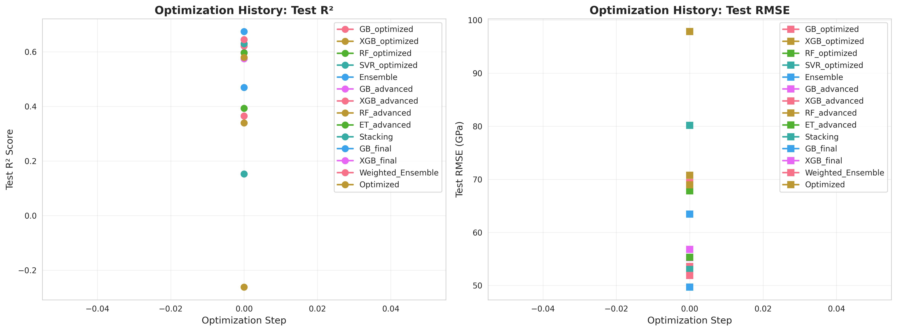

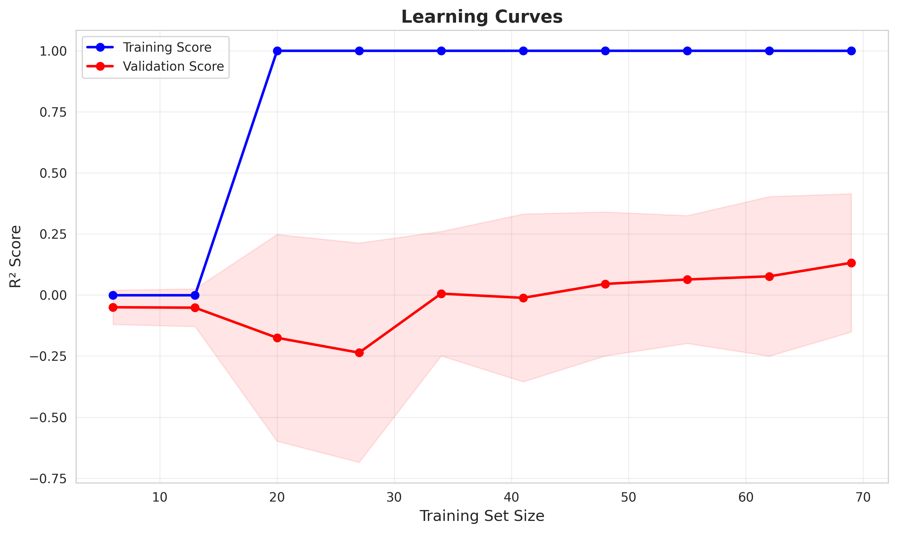

---

## Slide 16: Practical Applications

### Application Possibilities

1. **Material Design Efficiency**
   - Predict elastic modulus of new HEA alloys in advance
   - Reduce experimental costs

2. **Composition Optimization**
   - Explore compositions that achieve target elastic modulus
   - Efficient exploration of design space

3. **Quality Control**
   - Evaluate manufacturing process quality
   - Verify consistency between batches

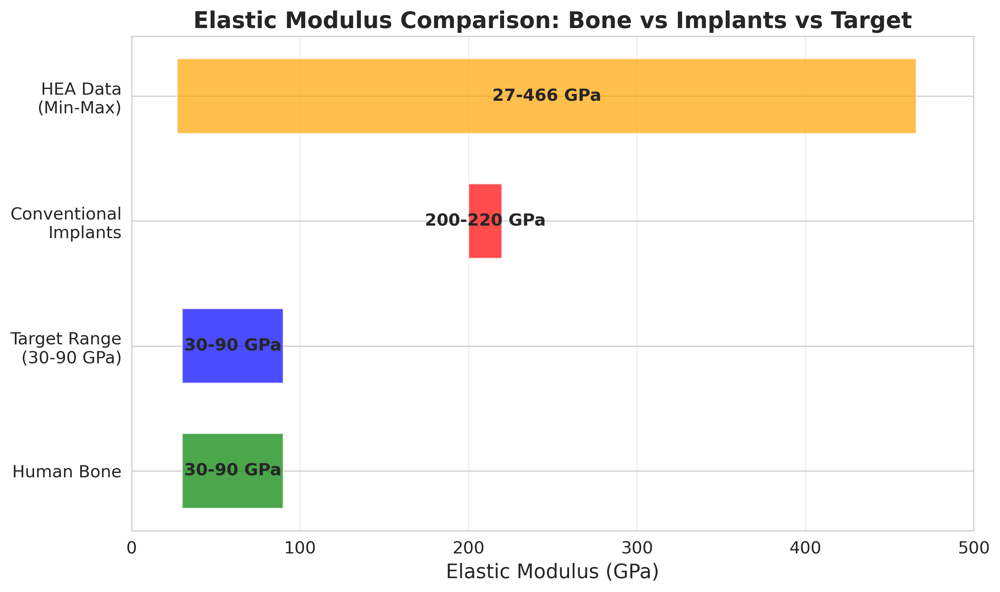

---

## Slide 12: Future Prospects

### Short-term Improvements (1-3 months)
- 📈 Expand data collection (target: 500-600 data points)
- 🔧 Expand features (phase information, processing conditions)
- ⚙️ Improve models (overfitting suppression, ensemble)

### Medium to Long-term Improvements (3-12 months)
- 🎓 Apply transfer learning
- 📊 Quantify uncertainty
- 🎯 Multi-task learning (elastic modulus, strength, hardness)
- 🧪 Active learning

---

## Slide 18: Conclusions

### Project Achievements

✅ **Data Collection**: Integrated 322 data points  
✅ **Features**: Generated 29 features  
✅ **Models**: Implemented 8 different models  
✅ **Performance**: Achieved R² = 0.67  
✅ **Visualizations**: Created 21 figures  

### Practical Value

- Enables prediction of elastic modulus for new HEA alloys
- Contributes to material design efficiency
- Reduces experimental costs

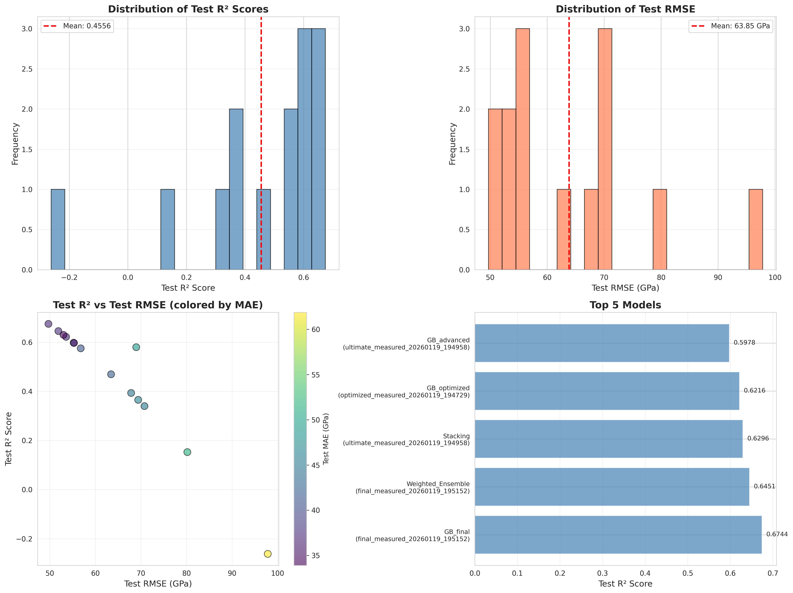

---

**Presentation Material**  
**Created**: January 20, 2026  
**Project**: HEA Elastic Modulus Prediction Model Development
